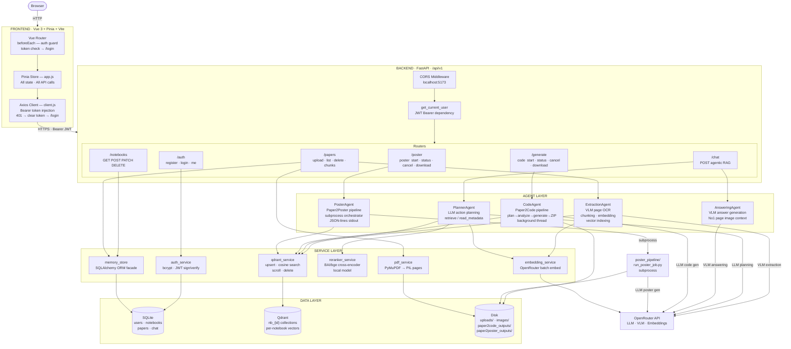
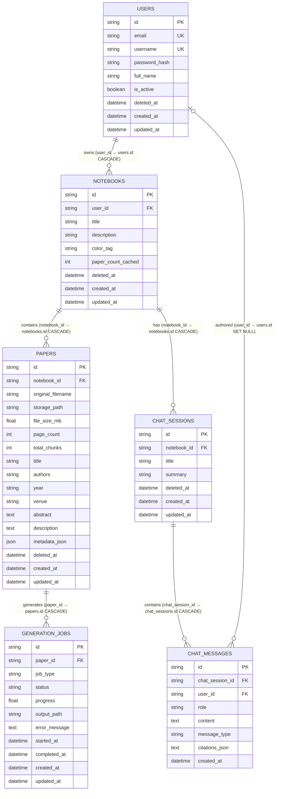
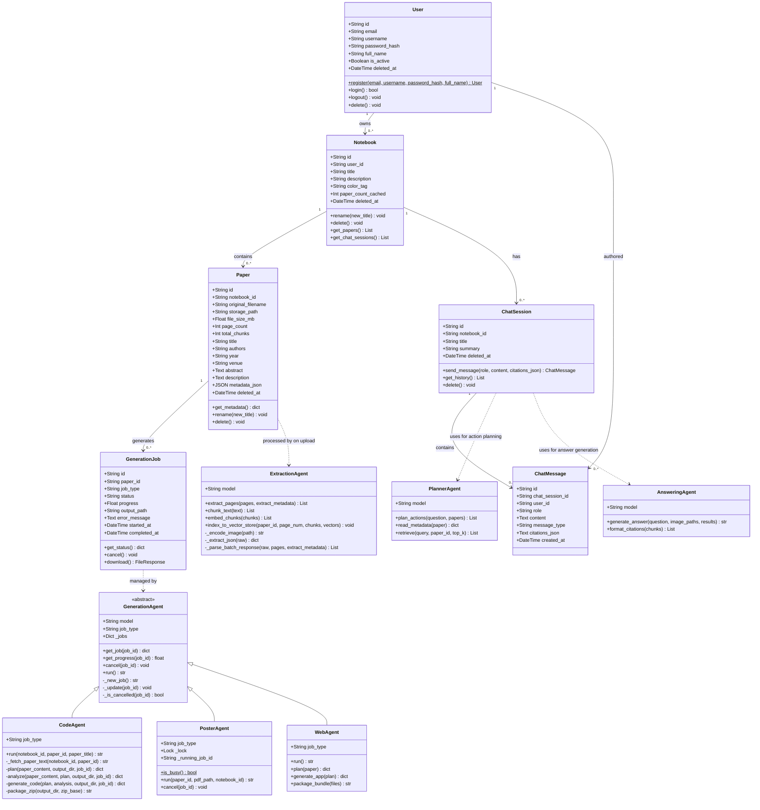
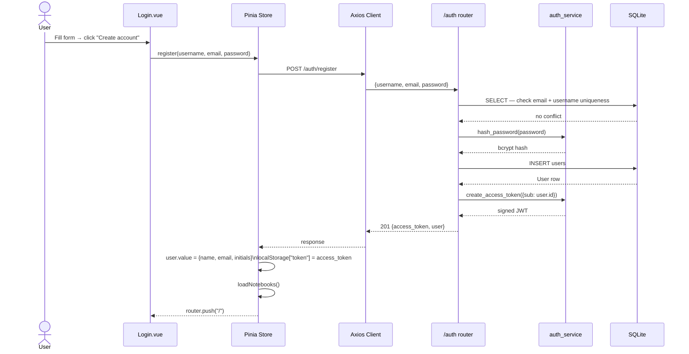
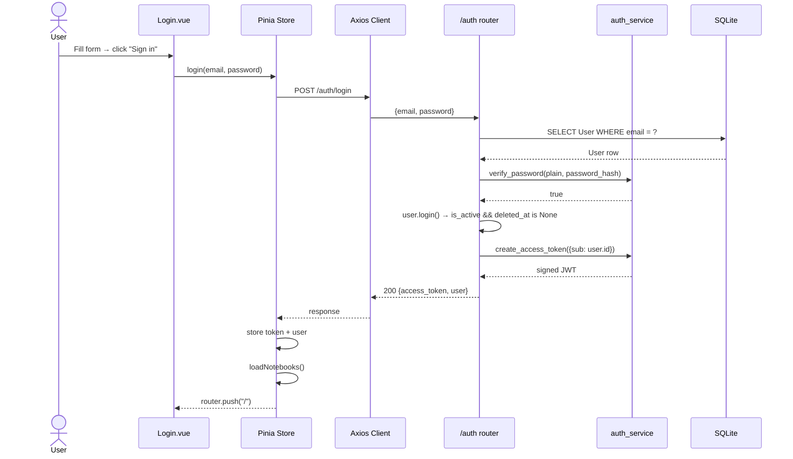
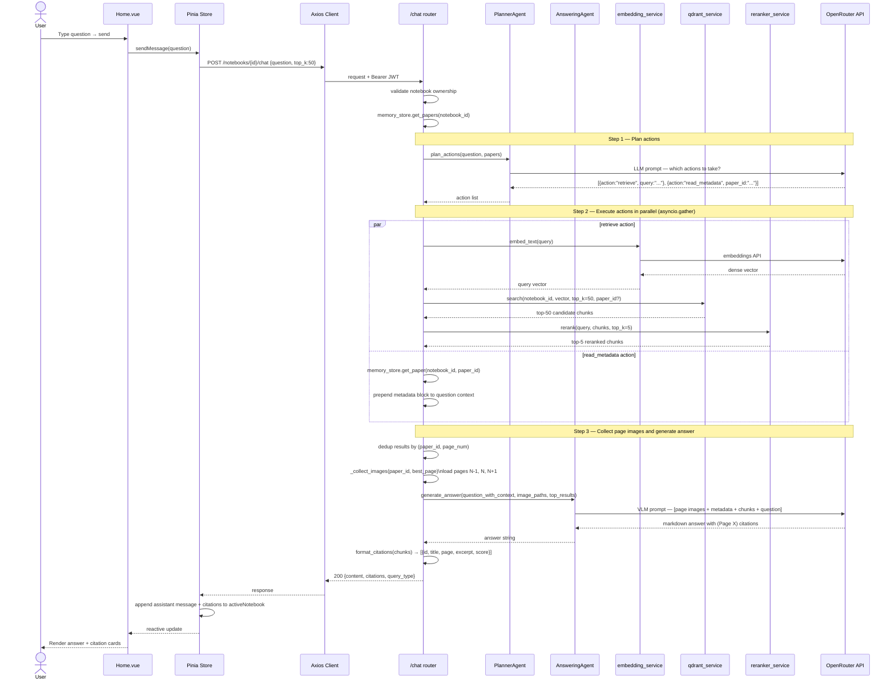
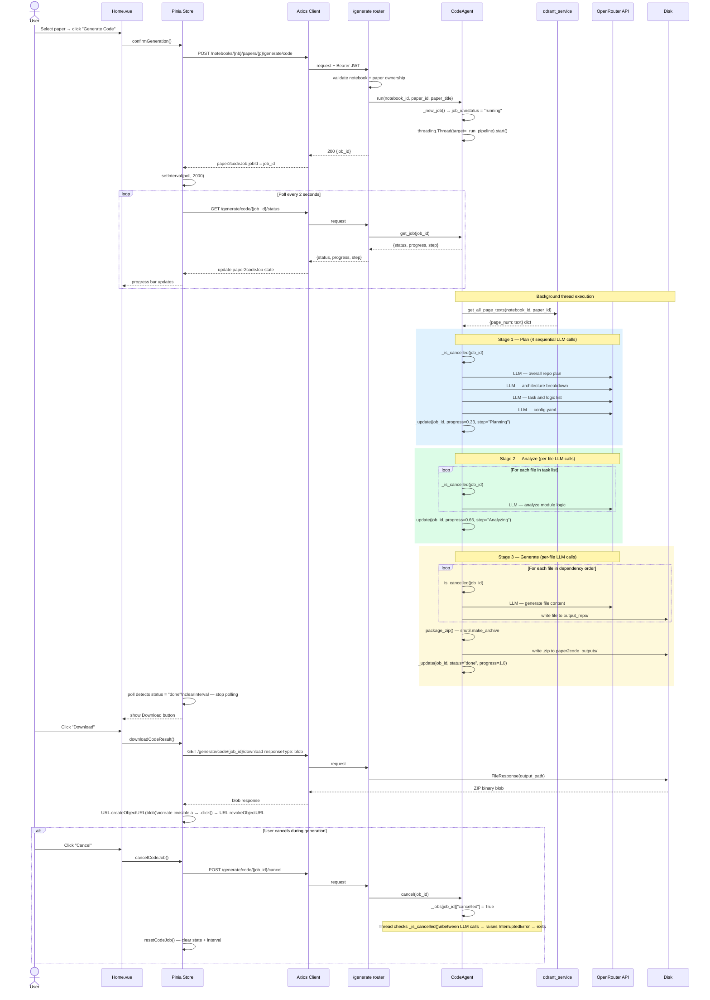

# VibeProject — System Design

---

## 1. System Architecture

---

## 2. Entity Relationship Diagram

---

## 3. Class Diagram

---

## 4. Sequence Diagrams

### 4.1 Register

---

### 4.2 Login

---

### 4.3 Agentic RAG Chat

---

### 4.4 Paper2Code Generation

